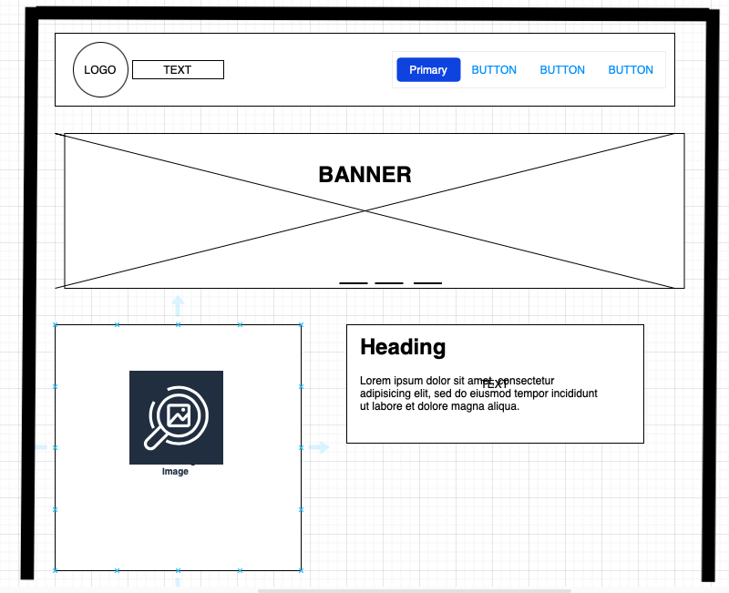

# Assignment1
Web app development Assignment 1 

# Website Method of Healing
https://leslylopez43.github.io/

This is a Website template frame. showcasing the Elena Method of Healing.


## Wireframe for ipad


## Wireframe for Iphone 12 Pro max


## Table of Contents

- [About Me](#about-me)
- [Gregory Grabovoi](#gregory-grabovoi)
- [Method Yuen](#method-yuen)
- [Screenshots](#screenshots)
- [Description](#description)
  - [About us](#about-us) 
- [Installation](#installation)
- [Usage](#usage)
- [Contributing](#contributing)
- [License](#license)
- [Contact](#contact)
- [Footer](#footer)

## Screenshots


## validator w3 HTML

 https://validator.w3.org/nu/#textarea


## validator w3 CSS


## lighthouse resource with chrome


## Technologies Used

- HTML
- CSS
- Bootstrap
- JavaScript

 ## resources used
 logo create with the free wix logo maker.
 https://www.wix.com/createlogo6/logo-maker?utm_source=google&utm_medium=cpc&utm_campaign=19604758696%5E145500310236&experiment_id=logo%20creator%20free%5Ee%5E645859685514%5E&gclid=CjwKCAjwhJukBhBPEiwAniIcNV20T0x_kC4ukp43mHa7YOzVXOP887Uh7BpS8KuTIyBR3YIAOMKdKhoCQB0QAvD_BwE
remove background logo 


# Project Name

Short description of the project.
remove/bg.com
## Description

This website showcases the Elena Method of Healing and the activities of the DR kam Yuen and Grigori Grabovoy and Foundation. It includes sections on scientific and technological research, the foundation's activities, and contact information.

## Scientific and Technological Research

The Foundation works by directly and indirectly supporting the scientific and technological research carried out by Grigori Grabovoi and spreading the scientific discoveries and technological devices of Grigori Grabovoi at an international level. PRK-1U – a device for the development of concentrations for eternal life – is currently available, also in the variant developed for medical profiles.


## Gregory Grabovoi


Grigori Grabovoi is a Russian Scientist and clairvoyant, Doctor of Physical-mathematical Sciences Doctor of technical Sciences, engaged throughout his career in various government programs, especially in the field of space technology.

Graduated in mathematics and mechanical physics. He was an academic in Russia and worked on important government and space programs. A member of the New York Academy of Sciences and the International Academy for Social and Economic Development, he has devoted himself to the study of different disciplines such as philosophy, medicine, and jurisprudence, with the aim of unifying the different fields of human knowledge.

For the results of his scientific research, he was awarded the Silver Medal by the Russian Academy of Natural Sciences and the "Peter the Great" Medal for the development of Science and Economics.

In 2008, he ran for the Russian presidential election with the intention of leading the process of transforming consciences also in political terms. Since then, he has been the subject of an extensive slander campaign by the Russian media.


## Grigori Grabovoy Foundation

Activity: Keep strong, spirit, mind, and body. The Foundation’s main activity is in scientific research and in the provision of free health care for all, by providing online self-healing services and opening medical research institutes specialized in the treatment of the main diseases that afflict human beings.


## Method Yuen


The Science of Immediate Results.

To Experience a New Science of Activating Your Physical Intelligence (PI) in alignment with Modern Computer Artificial Intelligence (AR).

Kam Yuen, (born in Hong Kong), is a Chinese-born American martial arts expert who was the consultant and stunt coordinator for the original television series Kung Fu. He also played the roles of Wong Ti and Lin Wu in the series and was the double for Keye Luke, who played Master Po in the series.

Yuen was David Carradine's martial arts instructor. He credited Yuen as the inspiration for the series' main character, Kwai Chang Caine. Carradine's book, The Spirit of Shaolin, was dedicated to Kam.

A grandmaster of Shaolin kung fu and known as the "Praying Mantis of North America" for his skill in the fighting style, Yuen's film credits include the role of Red Band in Circle of Iron, co-written by Bruce Lee which was produced posthumously and also stars Carradine, and Project Eliminator. Yuen graduated from Manhattan College in 1964.

A former aerospace engineer, he is also noted for his expertise in tai chi and qigong, as well as feng shui.

He authored several books on the subject including Beginning Kung-Fu and Technique and Form of the Three Sectional Staff in Kung Fu (Literary links to the Orient). He is also a 2012 inductee in the Martial Arts History Museum's Hall of Fame.

In addition, World Black Belt has called him a living legend.

He is also a doctor of chiropractic and now consults patients who suffer from chronic pain. His method was initially called Yuen Energetics, but it was changed to the "Yuen Method", co-founded with Marnie Greenberg.

According to Yuen and Greenberg, the Yuen Method "relieves pain through feeling for the exact causes of pain... [termed] weaknesses, then strengthening the deletion process for the deletion to take place," and the process then resets "the mind, body, spirit".

## About us
Method of London believes in using ancient healing knowledge that is <mark>scientifically researched</mark> and creating practical lifestyle enhancement programmes for individuals looking to initiate the journey of bettering their health. 
 Our mediation and therapies schedules engage you in the process of spiritual wellness; Our qualified experienced trainers guide you through the programs taking into account your core stability and muscular endurance; 
 Our Doctors create diet plans and prescribe curative therapies based on your personal requirements, thereby creating a result-oriented retreat for you.
## to watch our proyect


## to allowed to use or request
they allowed to fill a form , 
to contact by watsapp, 
to watch some short videos. 
to redirect another website.

## About Me 

Follow me on YouTube: [youtube.com/channel/your-channel](https://www.youtube.com/channel/your-channel)

### Some Links
Some useful links:
[How to Cure Yourself](https://www.youtube.com/watch?v=dMqVh1hl6pA)

- [YouTube video 2](https://www.youtube.com/embed/dMqVh1hl6pA)
- [YouTube video 3](https://youtu.be/HnZRrKTRmcY)
- [YouTube video 4](https://youtu.be/GulTOKIK3bE)
- [YouTube video 5](https://youtu.be/vCcbCS5dtbI)


Elena Alzate London Metodos De Sanacion @elenaalzatelondonmetodosde4258

## Contact Me

### Complete the Form

To complete the form, follow these steps:

1. Fill in the required fields:
   - Email address: Enter your email address. We'll never share it with anyone else.
   - Password: Enter a password that is 8-20 characters long.
   - Wellness objective: Select your wellness objective from the dropdown menu.
   - First Name: Enter your first name.
   - Last Name: Enter your last name.
   - Comments: Leave any comments or additional information in this field.

2. Check the "I acknowledge terms & conditions" checkbox to indicate that you agree to the terms.

3. Click the "Submit" button to submit the form.

## Form

To submit the form, please fill in the required fields and click the "Submit" button.

- **Email address**
  - Description: Enter your email address.
  - Field: `<input type="email" id="exampleInputEmail1" required>`

- **Password**
  - Description: Enter a password.
  - Field: `<input type="password" id="inputPassword6" required>`

- **Wellness objective**
  - Description: Select your wellness objective.
  - Field:
    ```html
    <select id="wellnessObjective" required>
      <option selected disabled value="">Select an option</option>
      <option value="1">Healing/Disease Reversal</option>
      <option value="2">Immunity Boost</option>
      <option value="3">Stress</option>
      <option value="4">Fitness</option>
      <option value="5">Injury</option>
      <option value="6">Business</option>
      <option value="7">Love</option>
      <option value="8">Anything Else</option>
    </select>
    ```

- **First Name**
  - Description: Enter your first name.
  - Field: `<input type="text" id="firstName" placeholder="First Name" required>`

- **Last Name**
  - Description: Enter your last name.
  - Field: `<input type="text" id="lastName" placeholder="Last Name" required>`

- **Comments**
  - Description: Leave a comment.
  - Field: `<textarea id="comments" placeholder="Leave a comment here" style="height: 100px" required></textarea>`

- **Terms and Conditions**
  - Description: Acknowledge the terms and conditions.
  - Field: `<input type="checkbox" id="exampleCheck1" required>`
  - Label: `I acknowledge terms & conditions.`

To submit the form, click the "Submit" button.

- Button: `<button type="submit">Submit</button>`


### Send me an Email

You can also email me at [seletos831@hotmail.com](mailto:seletos831@hotmail.com).

## Installation

1. Clone the repository: `git clone https://github.com/your/repository.git`
2. Open the `index.html` file in your web browser.

## Usage

Feel free to modify the website as per your requirements. Update the images, texts, and links according to your needs.

## Contributing

Contributions are welcome! Please fork the repository and submit a pull request.

Contributions to this project are welcome! If you have any improvements or new features to suggest, please follow these steps:

Fork the repository by clicking the "Fork" button on the GitHub repository page.
Clone the forked repository to your local machine.
bash
Copy code
git clone https://github.com/your-username/repository.git
Create a new branch for your contribution.
arduino
Copy code
git checkout -b feature/new-feature
Make your desired changes to the code.
Commit your changes with a descriptive commit message.
sql
Copy code
git commit -m "Add new feature"
Push your changes to your forked repository.
arduino
Copy code
git push origin feature/new-feature
Open a pull request on the original repository and provide a clear description of your changes.
Once your pull request is reviewed and accepted, it will be merged into the main project.

Thank you for considering contributing to this project! Your efforts are greatly appreciated.

Please let me know if there's anything else I can help you with!

## License

This project is licensed under the [MIT License](LICENSE).

## Contact
## Footer

**Location:** London, UK.

**Around the Web:**
- [YouTube](https://youtube.com/channel/UCv3wZc-1329nH0f_CcWI9EA)
- [Instagram](https://www.instagram.com)
- [Facebook](https://www.facebook.com)
- [WhatsApp](https://api.whatsapp.com/send?phone=447429095266)
- [Twitter](https://www.twitter.com)

**About Method:**

---

© Software Developer Lesly 2022


